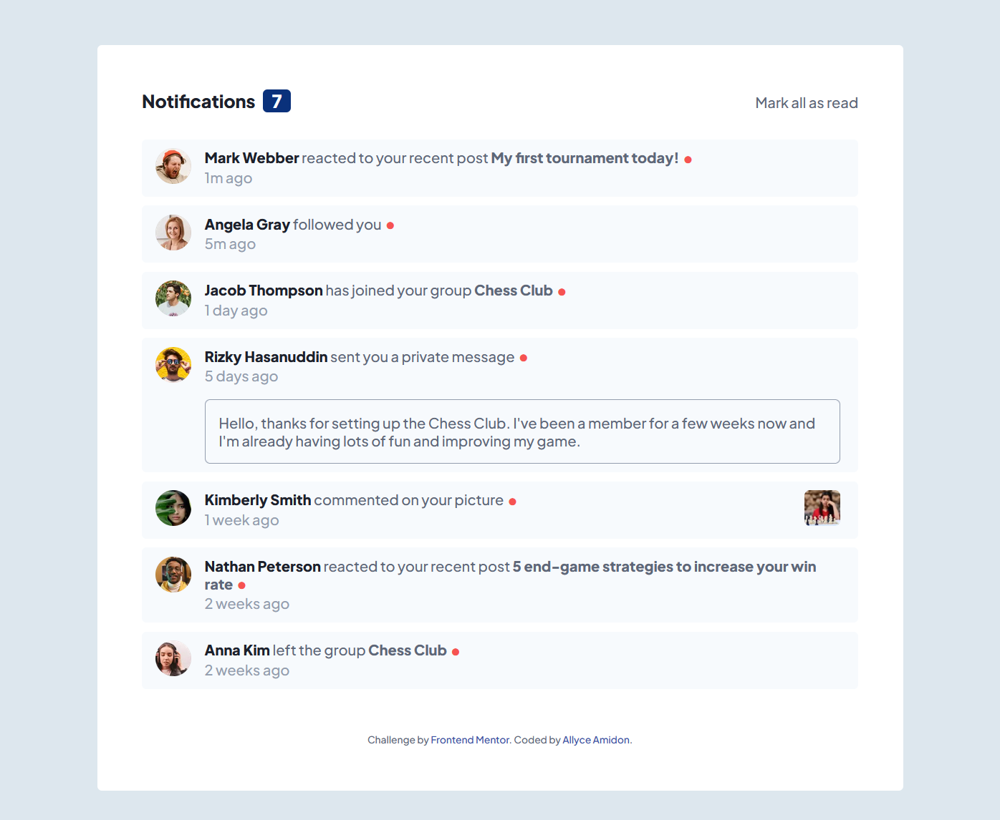
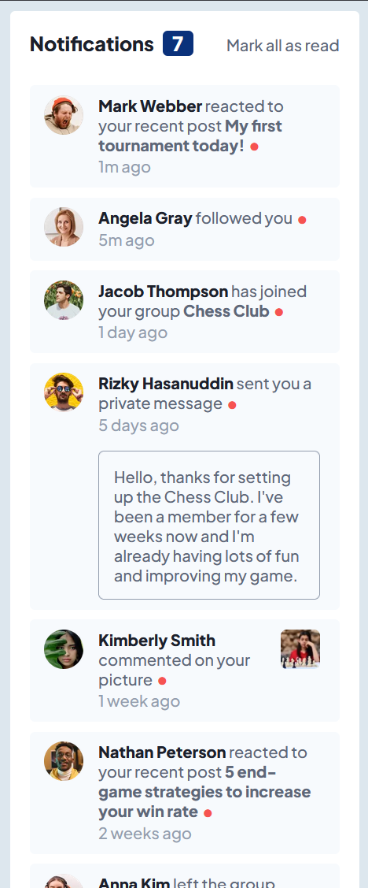

# Frontend Mentor - Notifications Page Solution

This is a solution to the [Notifications page challenge on Frontend Mentor](https://www.frontendmentor.io/challenges/notifications-page-DqK5QAmKbC). Frontend Mentor challenges help you improve your coding skills by building realistic projects. 

## Table of contents

- [Overview](#overview)
  - [The challenge](#the-challenge)
  - [Screenshot](#screenshot)
  - [Links](#links)
- [My process](#my-process)
  - [Built with](#built-with)
  - [What I learned](#what-i-learned)
  - [Useful resources](#useful-resources)
- [Author](#author)

## Overview

### The challenge

Users should be able to:

- Distinguish between "unread" and "read" notifications
- Select "Mark all as read" to toggle the visual state of the unread notifications and set the number of unread messages to zero
- View the optimal layout for the interface depending on their device's screen size
- See hover and focus states for all interactive elements on the page

### Screenshot




### Links

- Solution URL: [https://github.com/amidona/notifications-page-fm](https://github.com/amidona/notifications-page-fm)
- Live Site URL: [Add live site URL here](https://your-live-site-url.com)

## My process

### Built with

- Semantic HTML5 markup
- CSS custom properties
- Flexbox
- CSS Grid
- Mobile-first workflow
- Vanilla JavaScript

### What I learned

This was good practice at finding a specific parent element from a specific child element. In this case, my private-message text and the notifications themselves had generic class names, but I didn't want to give them unique IDs, because in a real social media notifications feed, that would quickly spiral into ridiculousness. Being able to find the closest parent element by class was enormously helpful (see the resources section below for links to the article).

```js
pm.forEach(pm => pm.addEventListener("mouseout", function () {
    let pmNotif = pm.closest("div.notification");
    pm.style.background = pmNotif.style.background
}))
```

### Useful resources

- [Get the closest Parent element by Class using JavaScript](https://bobbyhadz.com/blog/javascript-get-parent-element-by-class) - This was an enormously helpful and very easy to understand breakdown of the `closest()` method.

## Author

- Website - [Allyce Amidon](https://allyceamidon.com/)
- Frontend Mentor - [@amidona](https://www.frontendmentor.io/profile/amidona)
- GitHub - [@amidona](https://github.com/amidona)


